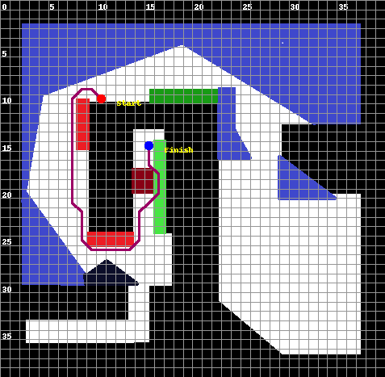
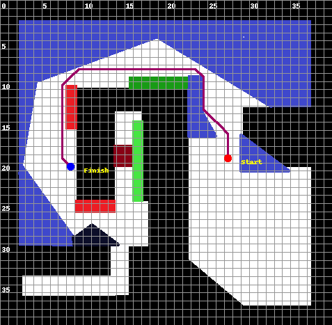
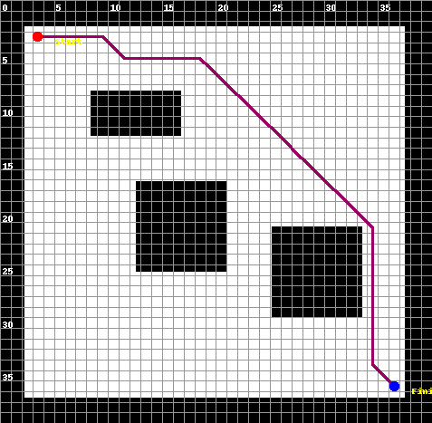
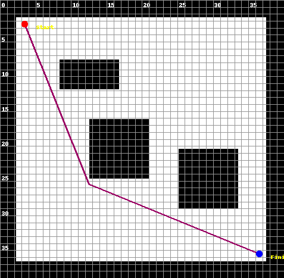
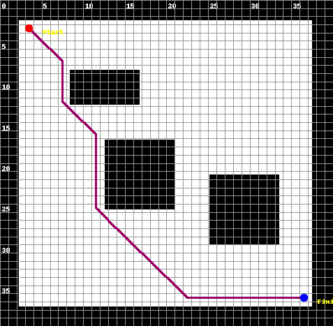
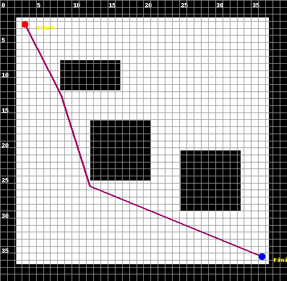
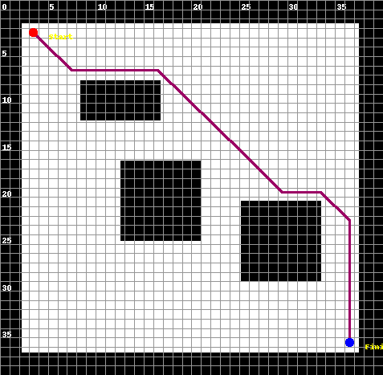
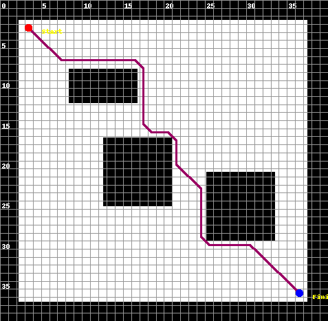
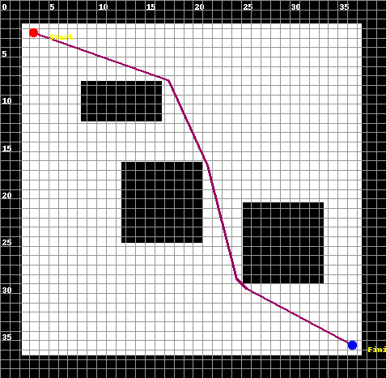
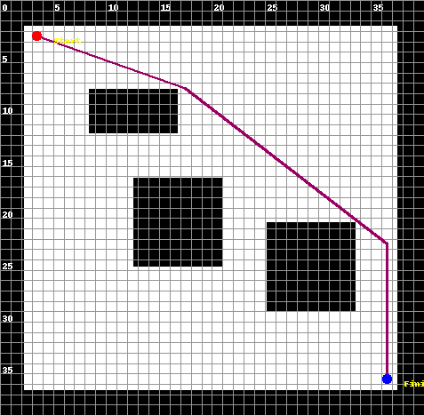

# Answers to the tasks proposed on [INFO.md](./INFO.md)

## Path-planning

### Path-planning Task1

The following command was run:

```bash
python ./src/run_path_planning.py \
  --scenario ./res/map.png \
  --start "(10,10)" \
  --finish "(15,15)" \
  --grid_size "(40,40)" \
  --algorithm Dijkstra      `# Dijkstra  || A* || theta`\
  --heuristic naive   `# manhattan || naive || euclidean || octile || dijkstra || chebyshev`\
  --scale 1 \
  --out ./out/task1Path.png
```

Output:

```txt
Running path plan from (10, 10) to (15, 15)
Map Size: (477, 467)
Chunk Size: (11.925, 11.675)
Search algorithm Dijkstra with heuristic naive * 1.001
Search algorithm took: 0.20184779167175293s
Planned path: [(125, 122), (113, 110), (101, 110), (89, 122), (89, 134), (89, 145), (89, 157), (89, 169), (89, 180), (89, 192), (89, 204), (89, 215), (89, 227), (89, 239), (89, 251), (101, 262), (101, 274), (101, 286), (101, 297), (113, 309), (125, 309), (137, 309), (149, 309), (160, 309), (172, 297), (172, 286), (172, 274), (172, 262), (184, 251), (196, 239), (196, 227), (196, 215), (184, 204), (184, 192), (184, 180)]
Path length: 35
Total path cost: 49
Total nodes expanded: 682
Outputting result to ./out/task1Path.png.
```

Image:



### Path-planning Task2

The following command was run:

```bash
python ./src/run_path_planning.py \
  --scenario ./res/map.png \
  --start "(27,19)" \
  --finish "(8,20)" \
  --grid_size "(40,40)" \
  --algorithm A*      `# Dijkstra  || A* || theta`\
  --heuristic naive   `# manhattan || naive || euclidean || octile || dijkstra || chebyshev`\
  --scale 1 \
  --out ./out/task2Path.png
```

Output:

```txt
Running path plan from (27, 19) to (8, 20)
Map Size: (477, 467)
Chunk Size: (11.925, 11.675)
Search algorithm A* with heuristic naive * 1.0
Search algorithm took: 0.03810000419616699s
Planned path: [(327, 227), (327, 215), (327, 204), (327, 192), (316, 180), (304, 169), (292, 157), (292, 145), (292, 134), (292, 122), (292, 110), (280, 99), (268, 99), (256, 99), (244, 99), (232, 99), (220, 99), (208, 99), (196, 99), (184, 99), (172, 99), (160, 99), (149, 99), (137, 99), (125, 99), (113, 99), (101, 110), (89, 122), (89, 134), (89, 145), (89, 157), (89, 169), (89, 180), (89, 192), (89, 204), (89, 215), (89, 227), (101, 239)]
Path length: 38
Total path cost: 38
Total nodes expanded: 612
Outputting result to ./out/task2Path.png.
```

Image:



### Path-planning Task3

The code of A* can be found at [../src/PathPlanPrinter/src/aStar.py](../src/PathPlanPrinter/src/aStar.py)

### Path-planning Task4

The code of theta can be found at [../src/PathPlanPrinter/src/theta.py](../src/PathPlanPrinter/src/theta.py)
It is based on [Theta*: Any-Angle Path Planning on Grids](https://arxiv.org/pdf/1401.3843.pdf)

### Path-planning Task5

The heuristic used by default is naive.

```python
def naive(point1, point2, scale=1):
    return scale
pp.register_heuristic('naive', naive)
```

* A scale factor of 0 transforms A* in dijkstra algorithm.
* A scale factor of infinite transforms A* in a greedy algorithm that strictly follows the provided heuristic.

### Path-planning Task6

The heuristic implementation has been taken from [Stanford.edu](http://theory.stanford.edu/~amitp/GameProgramming/Heuristics.html).

* **Manhattan**: great for maps that allow 4 movements at each grid point.
* **Octile**: great for maps that allow 8 movements at each grid point.
* **Chebyshev**: great for maps that allow 4 movements at each grid point.
* **Euclidean**: great for maps that allow any movement at each grid point.

Every heuristic implemented can be configured with a scale factor.
This cale factor directly multiplies the value obtained from the heuristic.
If it is about the correct magnitude will reduce the amount of nodes that are expanded.

* The ideal scale factor is about: (minimum cost of taking one step)/(expected maximum path length)

To perform estimations the heuristics calculate distances in pixels (NOT IN GRID DISTANCES!!!).

```python
def manhattan(point1, point2, scale=1):
    return scale * (abs(point1.point[0] - point2.point[0]) + abs(point1.point[1] - point2.point[1]))
pp.register_heuristic('manhattan', manhattan)


def euclidean(point1, point2, scale=1):
    return scale * math.sqrt(math.pow(point1.point[0] - point2.point[0], 2) + math.pow(point1.point[1] - point2.point[1], 2))
pp.register_heuristic('euclidean', euclidean)


def diagonal(point1, point2, mode, scale=1):
    d0 = abs(point1.point[0] - point2.point[0])
    d1 = abs(point1.point[1] - point2.point[1])
    return scale * (d0 + d1) + (mode - 2 * scale) * min(d0, d1)


def octile(point1, point2, scale=1):
    return diagonal(point1, point2, math.sqrt(2), scale)
pp.register_heuristic('octile', octile)


def chebyshev(point1, point2, scale=1):
    return diagonal(point1, point2, 1, scale)
pp.register_heuristic('chebyshev', chebyshev)
```

The source file can be found at: [../src/PathPlanPrinter/src/heuristics.py](../src/PathPlanPrinter/src/heuristics.py)

### Path-planning Task7

Command run:

```bash
for heuristic in 'manhattan' 'euclidean' 'octile' 'dijkstra' 'chebyshev'; do
  for algorithm in 'A*' 'theta'; do
    python ./src/run_path_planning.py \
      --scenario ./res/map2.png \
      --start "(3,3)" \
      --finish "(36,36)" \
      --grid_size "(40,40)" \
      --algorithm $algorithm      `# Dijkstra  || A* || theta`\
      --heuristic $heuristic   `# manhattan || naive || euclidean || octile || dijkstra || chebyshev`\
      --scale 1 \
      --out ./out/task7Path-$algorithm-$heuristic.png
  done
done
```

| Heuristic | A*                                                              | theta                                                                 | Expanded nodes |
|:---------:|:---------------------------------------------------------------:|:---------------------------------------------------------------------:|:--------------:|
| Dijkstra  |      |      | 949            |
| Manhattan |    |    | 48             |
| Euclidean |    |    | 47             |
| Chebyshev |    |    | 52             |
| Octile    |          |          | 47             |

When A* uses Dijkstra heuristic and scale of 1 it produces exactly the same output as Dijkstra algorithm.

The characteristics of each heuristic can clearly be seen on the images:

* **Manhattan** prefers straight lines over diagonals since it consider them as equal distance. L shape path are prone to be obtained
* **Euclidean** on the other hand prefers diagonals since from its point of view are the shorter path.
* **Chebyshev** prefers direct paths that go straight to the goal even though that can make it explore more nodes.
* **Octile** it is between euclidean and chebyshev, for grid maps with limited movements and few obstacles it is preferred over the others.

## Integration

The integration has been implemented in a slightly different way as the proposed one.
See [../README.md](../README.md) for more information.
To avoid problems it is recommended to download [Docker](https://www.docker.com/get-started) and use the web interface on [http://localhost:80](http://localhost:80) to use the integration part.

Also installing every dependency manually:

* numpy and PIL for the path planner
* optic for the pddl runner

and running:

```bash
python pddlRunner/src/run_pddl.py
```

from the [../src](../src) directory will do the trick.

More detailed instructions on how to run everything local (including the web server) can be found on [../Dockerfile](../Dockerfile) file.

### Integration output

For a total of 7 problem generated with the provided web tool their inputs and outputs can be found in [../src/pddlRunner/problems](../src/pddlRunner/problems).
The web version of each problem needs to be open from inside the problem folder, it will show the action list and the path plan images.
